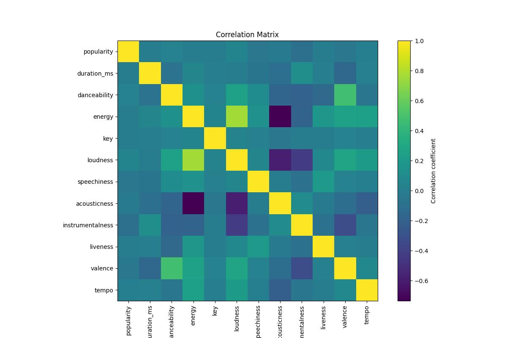

# Assignment 1 Report
Q1 )
    Generate Plots:
        Use histograms, box plots, and scatter plots to visualize feature distributions.
        Focus on numerical features like 'popularity', 'duration_ms', 'danceability', 'energy', 'loudness', etc.
        Observe skewness and outliers within the data.

    Observations:
        Outliers: Look for features with extreme values, which can influence the KNN algorithm.
        Skewed Data: Identify features with significant skewness. For example, 'popularity' might be skewed toward higher values.
        Feature Correlations: Use scatter plots and correlation matrices to identify which features are strongly correlated with the target variable (genre).

    Hierarchy of Important Features:
        After EDA, prioritize features based on their relevance to the classification task. Features with strong correlations to genres (e.g., 'danceability' or 'energy') should be given more weight during model development.

2.3 KNN Implementation

Task 2: Custom KNN Class

    Class Design:
        Create a KNN class to encapsulate model functionality.
        Allow the modification of k and distance metrics (e.g., Euclidean, Manhattan) through class attributes.

    Prediction Function:
        Implement a method to predict the class of new data points based on the closest k neighbors.

    Custom Metrics Class:
        Develop a separate class to calculate accuracy, precision, recall, and F1 scores (both macro and micro).
        Implement these calculations without relying on sklearn to ensure that all metrics are computed from scratch.

2.4 Hyperparameter Tuning

Task 3: Optimizing KNN Performance

    Optimal k and Distance Metric:
        Test various k values and distance metrics to find the combination that gives the best validation accuracy.

    Rank List:
        Generate a list of the top 10 {k, distance metric} pairs sorted by validation accuracy.

    Plot Accuracy vs. k:
        Choose a particular distance metric and plot how accuracy changes with different k values.

    Column Dropping:
        Experiment with dropping various columns to see how it affects accuracy. Document the combination that results in the best performance.

    Bonus Task:
        Exhaustively test all combinations of columns to find the best subset for prediction accuracy and compare it with the EDA findings.

2.5 Optimization

Task 4: Enhancing KNN Efficiency

    Vectorization:
        Optimize the KNN algorithm by replacing loops with vectorized operations to reduce time complexity to O(n).
    Inference Time Plots:
        Compare the inference time of the initial KNN model, the best KNN model, the most optimized version, and the default sklearn KNN.
    Inference Time vs. Train Size:
        Plot inference time against the size of the training data for the above models and document the results.

2.6 A Second Dataset

Task 5: Application to New Data (300-400 words)

In this task, the best {k, distance metric} pair identified from previous tuning is applied to a second dataset (spotify-2) that has already been split into training, validation, and testing sets. The goal is to evaluate the performance of the chosen KNN model on this new dataset and observe how well it generalizes.

Upon applying the optimized KNN model, several observations can be made. Firstly, the accuracy on the test set of this new dataset provides insight into the model's generalizability. A significant drop in accuracy might suggest that the model overfitted the original dataset, while a similar performance would indicate robust generalization.

Moreover, analyzing the distribution of predictions across different genres can reveal any biases in the model. For instance, if the model struggles with certain genres, it might indicate that those genres were underrepresented in the original training data or that the feature patterns associated with them are not as distinct.

Another crucial aspect to consider is the execution time on this new dataset. Given that the dataset is pre-split, the training and inference times can provide a good comparison with the previous dataset. If the new dataset is significantly larger, the time complexity improvements made in the optimized model should manifest clearly.

Finally, a comparison of performance metrics (accuracy, precision, recall, F1 score) between the original and new datasets will offer deeper insights into the strengths and limitations of the model. Any discrepancies in performance can guide future model improvements or highlight the need for further hyperparameter tuning.

In conclusion, applying the KNN model to this new dataset tests its adaptability and generalization capability. It allows for a more comprehensive evaluation of the model's performance beyond the original dataset, ensuring that the model is reliable for broader applications.

